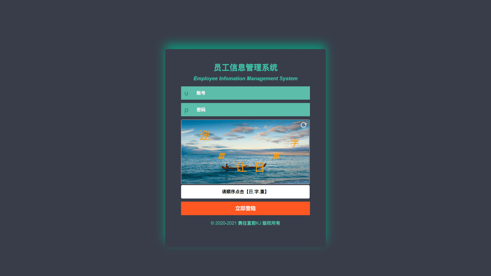
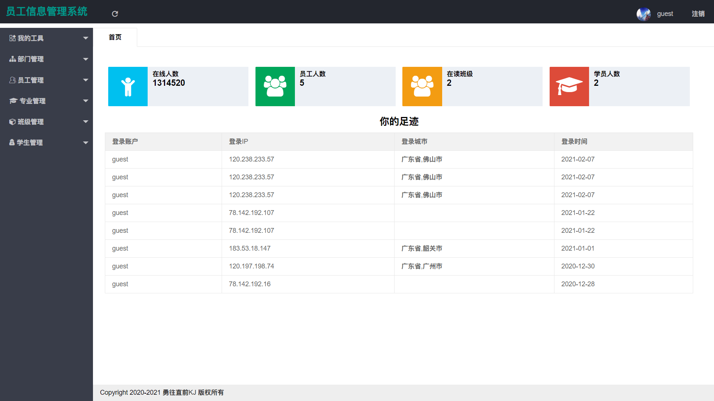
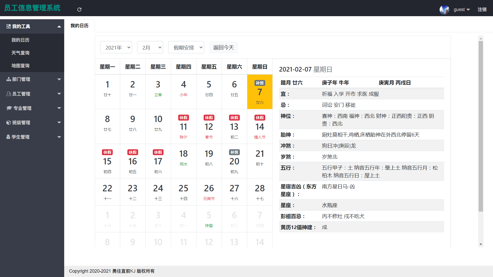
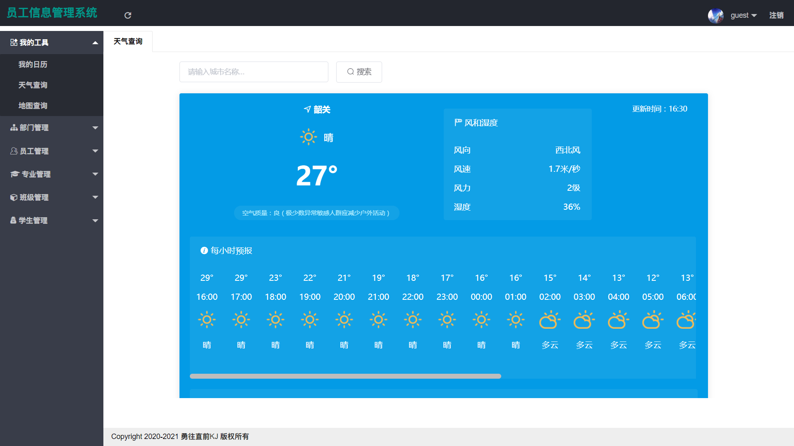
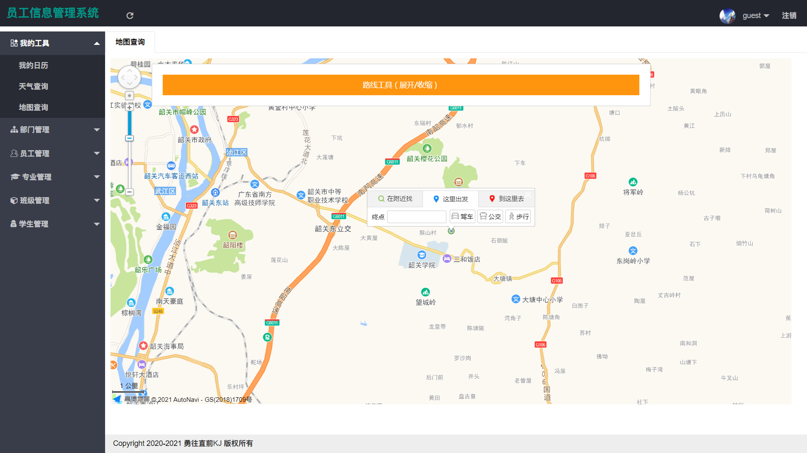
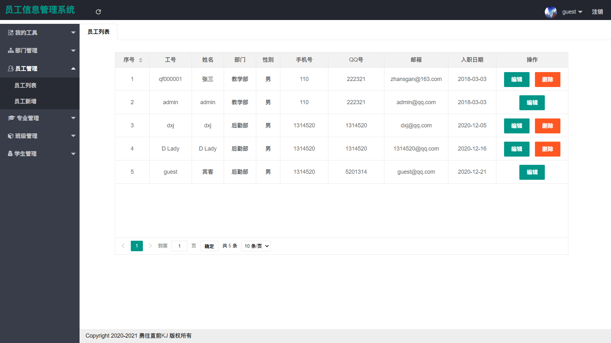
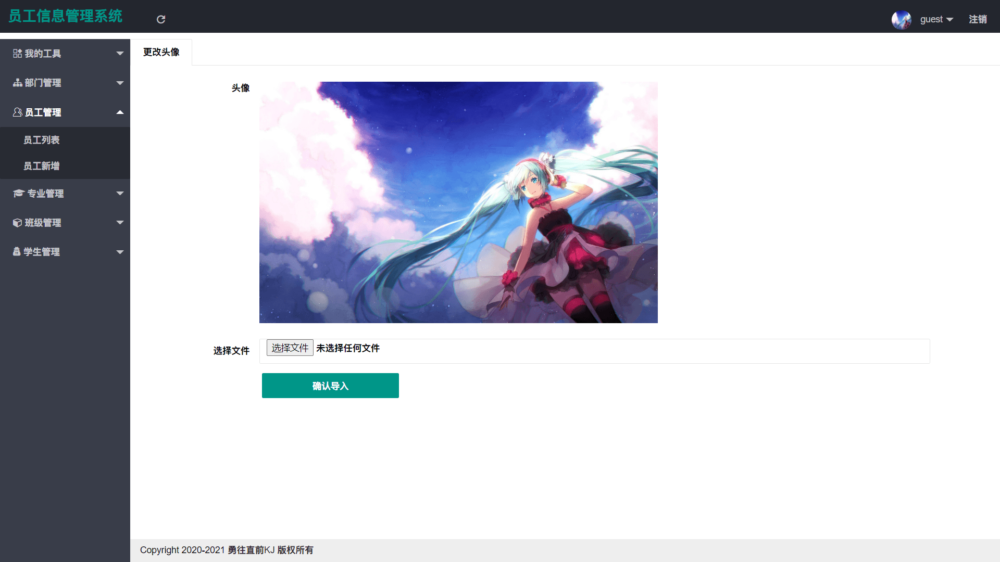

# 员工信息管理系统

#### 介绍
本项目通过设计一个信息管理系统实现员工信息的便捷管理，同时提供几个有趣的生活小工具给用户使用。主要功能包括登录注册、我的工具（万年历 / 天气 / 地图查询）、部门管理、员工管理、专业管理、班级管理、学生管理等。

#### 链接

员工信息管理系统：[http://software.yongkj.cn/emp/](http://software.yongkj.cn/emp/)
> 账户：guest
> 密码：guest

#### 截图

#### 技术栈

MySQL+SpringBoot+Spring+SpringMVC+MyBatis+HTML+CSS+JS+JQuery+Layui+Vue+Element UI

1.  前端使用了 JQuery 库操作 DOM 以及 Layui 框架来实现页面布局
2.  后端则使用 SpringBoot 来整合 SSM 框架（Spring + SpringMVC + MyBatis）开发数据接口
3.  利用免费的万年历接口实现日历查询，包括节假日信息等
3.  使用 Vue 框架完成万年历以及天气查询生活小工具
4.  采用京东万象免费天气查询接口实现天气查询功能
5.  利用高德地图免费查询接口开发地图查询功能
6.  学生数据的 Excel 文件导入导出功能使用 Apache POI 完成
7.  后台的数据存储主要采用开源的Mariadb数据库来完成

#### 功能特性

1.  实现万年历查询功能，用户可看到日期对应的农历信息
2.  拥有天气查询功能，可查询每小时预报，未来一周预报
3.  也有地图查询功能，简单浏览当前的位置信息等
4.  部门 / 员工 / 专业 / 班级 / 学生信息的增加、删除、查询、修改功能等
5.  学生数据可导出为 Excel 文件以及从 Excel 文件中导入学生数据

#### 使用说明

1.  ssm_oa.sql 为数据库备份文件
2.  可在 src/main/resources/db.properties 文件中修改数据库连接信息
3.  一些 API 接口信息尚且保留，可直接使用
4.  如需打包部署服务器，则可以使用 Eclipse 或者 IDEA 打包项目，默认打包为 War 包
